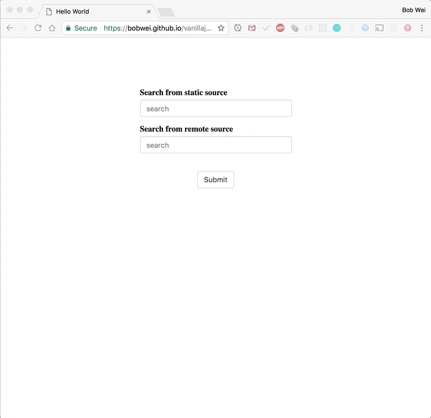

# Vanillajs AutoComplete



This is a demo project for showing auto-complete functionality using vanillajs.

- [Demo](#demo)
- [Usage](#usage)
- [Features](#features)
- [How it Works](#how-it-works.md)


## Demo

- Live demo : [https://bobwei.github.io/vanillajs-autocomplete/](https://bobwei.github.io/vanillajs-autocomplete/)
- Local Demo :
  - example/index.html
  - example/index.js

There is also a prebuilt version that works locally. Please open dist/index.html to check it out.


## Usage

index.html
```html
<form>
  <div class="form-group">
    <label>Search from static source</label>
    <input id="static-source" type="text" class="form-control" autocomplete="off" placeholder="search" />
  </div>
  <div class="form-group">
    <label>Search from remote source</label>
    <input id="remote-source" type="text" class="form-control" autocomplete="off" placeholder="search" />
  </div>
  <div class="text-center">
    <button id="btn-reset" type="submit" class="btn btn-default">Submit</button>
  </div>
</form>
```

index.js
```js
import AutoComplete from 'modules/AutoComplete';

const el = document.querySelector('input');
AutoComplete({
  el,
  data: [{
    value: 'B612',
    thumbnail: 'https://d.line-scdn.net/stf/line-lp/family/en/b612_190.png',
  }, {
    value: 'LOOKS',
    thumbnail: 'https://d.line-scdn.net/stf/line-lp/line_looks_190x190.png',
  }],
  getPersistKey: () => 'auto-complete:history:0',
});
```


## Features

- Use store for state management and one way data flow
- Create store for each AutoComplete instance
- Subscribe to state change and update corresponding UI
- Declarative DOM manipulation
- Subscribe to state change and persist to storage


## How it Works

AutoComplete is compose of components, store and event handlers.
- [src/modules/AutoComplete/index.js](./src/modules/AutoComplete/index.js)

__Store__ is responsible for state management and as the single source of truth for any state including isOptionListHidden, focusIndex, value, data, history and so on.
- [src/modules/stores/createStore.js](./src/modules/stores/createStore.js)

__Event handlers__ are subscribing to the state change and reflect corresponding changes to UI. Event handlers here are factory functions that receive props as input and return event handler function that can handle user action and access props from closure.

__Components__ are functions that return elements. It's composable, reusable and declarative.

__History__ is implemented simply by persisting store state to storage since store is the single source of truth for every state.
- [src/modules/persistences/persistStore.js](./src/modules/persistences/persistStore.js)

__Watch__ It's a utility function that help us subscribing to state change that we concern.
- [src/modules/utils/watch.js](./src/modules/utils/watch.js)
